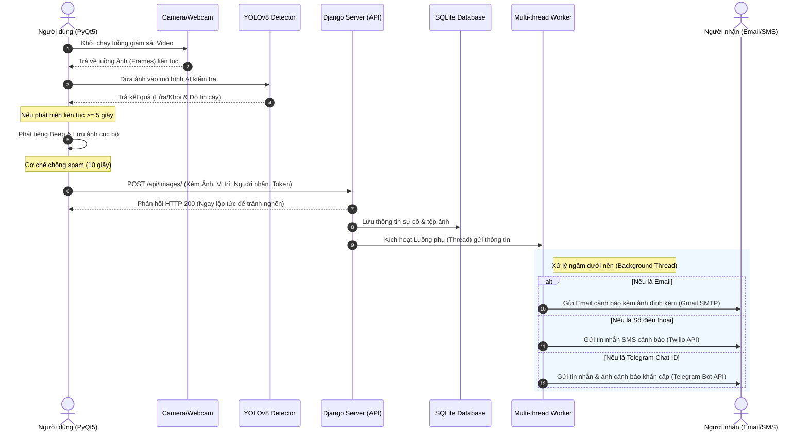

# 🧯 Hệ thống Phát hiện & Cảnh báo Hỏa hoạn Thông minh (YOLOv8 + PyQt5 + Django)

Hệ thống tích hợp Trí tuệ Nhân tạo (AI) giúp phát hiện lửa và khói trong thời gian thực qua Camera, tự động phát âm thanh báo động tại chỗ, đồng thời gửi thông tin cảnh báo (kèm ảnh chụp thực tế) ngay lập tức tới Email hoặc số điện thoại (SMS) của người chịu trách nhiệm thông qua máy chủ Django chạy ngầm đa luồng.

---

## 📌 Các Tính Năng Nổi Bật

*   **Nhận diện thời gian thực (Real-time AI):** Sử dụng mô hình **YOLOv8** được huấn luyện tối ưu (`best.pt`) để phát hiện đám cháy (`Fire`) và khói (`Smoke`) với độ chính xác và tốc độ cao.
*   **Giao diện Giám sát trực quan (PyQt5):** Ứng dụng Desktop chuyên nghiệp viết bằng PyQt5 giúp hiển thị luồng video trực tiếp từ Webcam/Camera giám sát, khoanh vùng đối tượng nguy hiểm kèm tỉ lệ tin cậy (Confidence).
*   **Bộ lọc cảnh báo thông minh (Chống báo giả & Spam):**
    *   *Xác thực 5 giây:* Chỉ kích hoạt chuông báo và gửi cảnh báo khi phát hiện thấy lửa/khói liên tục trong **5 giây** trở lên.
    *   *Giới hạn gửi tin (Cooldown 10s):* Chỉ gửi tối đa 1 cảnh báo lên server trong mỗi **10 giây** nhằm tránh spam hòm thư hoặc tài khoản SMS khi xảy ra cháy liên tục.
*   **Báo động tại chỗ:** Phát âm thanh cảnh báo tần số cao (`winsound.Beep`) ngay lập tức trên máy tính giám sát khi có sự cố.
*   **Máy chủ Quản trị & Điều hướng Cảnh báo (Django REST Framework):**
    *   *Quản lý tài khoản:* Đăng ký, đăng nhập và xác thực bằng cơ chế Token bảo mật.
    *   *Xử lý tác vụ ngầm (Multi-threading):* Tự động tách luồng xử lý gửi Email và SMS riêng biệt (background threads), giúp API trả kết quả về ứng dụng PyQt5 ngay tức thì mà không bị nghẽn mạng.
    *   *Định dạng người nhận linh hoạt:* Tự động quét Regex/Tiền tố để nhận diện thông tin người dùng nhập vào là **Email**, **Số điện thoại** hay **Telegram Chat ID** để gửi hình thức cảnh báo tương ứng:
        *   **Email (Gmail SMTP):** Gửi thư cảnh báo khẩn cấp **đính kèm trực tiếp ảnh chụp** đám cháy được cắt từ Camera.
        *   **SMS (Twilio API):** Gửi tin nhắn SMS khẩn cấp tới số điện thoại di động đăng ký.
        *   **Telegram Bot API:** Gửi tin nhắn cảnh báo khẩn cấp kèm hình ảnh thực tế trực tiếp qua Telegram tới Chat ID cá nhân hoặc Chat ID nhóm (Group Chat).
    *   *Hệ thống gửi cảnh báo song song (Parallel Alerts):* Nếu cấu hình Telegram Bot hợp lệ trên máy chủ Django, hệ thống sẽ tự động gửi thêm tin nhắn Telegram bổ sung song song bất kể người dùng chọn Email hay SMS trên ứng dụng PyQt5, đảm bảo không bỏ lỡ cảnh báo.
    *   *Trang Dashboard lịch sử:* Giao diện web Django lưu trữ toàn bộ ảnh chụp sự cố, thời gian xảy ra, vị trí cụ thể và cho phép tra cứu, quản lý lịch sử hỏa hoạn thông minh.

---

## 📐 Sơ Đồ Kiến Trúc Hệ Thống (System Architecture)



---

## 📂 Cấu Trúc Thư Mục Dự Án

```text
📂 fire_detection_project
├── 📂 fire_detection                # Thư mục mã nguồn chính của hệ thống
│   ├── 📂 pyqt_user_app             # 🖥️ Ứng dụng giám sát client (PyQt5 Desktop App)
│   │   ├── 📂 models                # Nơi lưu trữ file trọng số YOLOv8 (.pt)
│   │   │   └── best.pt              # Trọng số AI đã được huấn luyện phát hiện lửa/khói
│   │   ├── 📂 saved_frames          # Thư mục tự động tạo để lưu ảnh chụp hỏa hoạn
│   │   ├── 📂 sound                 # Chứa các tệp âm thanh cảnh báo
│   │   ├── 📂 UI                    # Chứa các file thiết kế giao diện PyQt (.ui)
│   │   │   ├── login_window.ui
│   │   │   ├── settings_window.ui
│   │   │   └── detection_window.ui
│   │   ├── detection.py             # Luồng xử lý camera & nhận diện YOLOv8
│   │   ├── detection_window.py      # Giao diện hiển thị camera giám sát
│   │   ├── login_window.py          # Giao diện đăng nhập & lấy Token từ Server
│   │   ├── settings_window.py       # Giao diện cấu hình vị trí & thông tin liên hệ
│   │   └── main.py                  # Điểm khởi chạy ứng dụng PyQt5 chính
│   │
│   ├── 📂 web_app                   # 🌐 Máy chủ quản lý & API cảnh báo (Django Web Portal)
│   │   ├── 📂 alerts                # App Django quản lý giao diện xem chi tiết sự cố
│   │   ├── 📂 alertupload_rest      # App Django REST cung cấp API nhận ảnh & gửi mail/SMS ngầm
│   │   │   ├── serializers.py       # Chuyển đổi dữ liệu và xác thực API
│   │   │   └── views.py             # Logic xử lý API chính, đa luồng & tích hợp Twilio, SMTP
│   │   ├── 📂 detection             # App Django quản lý cơ sở dữ liệu và bảng điều khiển
│   │   ├── 📂 wd_ss                 # Thư mục cấu hình cốt lõi của Django (settings.py, urls.py)
│   │   ├── db.sqlite3               # Cơ sở dữ liệu SQLite cục bộ
│   │   └── manage.py                # File công cụ quản lý dự án Django
│   │
│   └── requirements.txt             # Danh sách thư viện Python cần cài đặt
└── README.md                        # Tài liệu hướng dẫn sử dụng này
```

---

## 🛠️ Hướng Dẫn Cài Đặt & Cấu Hình

### 1. Chuẩn bị môi trường Python
Khuyên dùng Python từ **3.8 đến 3.11** để đảm bảo tính tương thích tốt nhất với PyQt5 và PyTorch (YOLOv8).

Mở Terminal tại thư mục gốc của dự án và chạy các lệnh sau:

```bash
# Tạo môi trường ảo (Virtual Environment)
python -m venv .venv

# Kích hoạt môi trường ảo
# Trên Windows:
.venv\Scripts\activate
# Trên macOS/Linux:
source .venv/bin/activate

# Cập nhật pip và cài đặt toàn bộ thư viện cần thiết
pip install --upgrade pip
pip install -r fire_detection/requirements.txt
```

> [!NOTE]
> File `requirements.txt` đã bao gồm đầy đủ các thư viện cốt lõi: `Django`, `djangorestframework`, `PyQt5`, `ultralytics` (YOLO), `opencv-python-headless`, `twilio`, và các thư viện hỗ trợ khác.

### 2. Cấu hình Máy chủ Django (`web_app`)

#### Bước A: Tạo tài khoản gửi Email (Gmail SMTP) và Twilio SMS
Mở file cấu hình Django tại `fire_detection/web_app/wd_ss/settings.py` và cập nhật các thông số bảo mật:

1. **Cấu hình Email (Gmail):**
   ```python
   EMAIL_BACKEND = 'django.core.mail.backends.smtp.EmailBackend'
   EMAIL_HOST = 'smtp.gmail.com'
   EMAIL_USE_TLS = True
   EMAIL_PORT = 587
   EMAIL_HOST_USER = 'your_gmail@gmail.com'          # Email của bạn dùng làm tổng đài gửi
   EMAIL_HOST_PASSWORD = 'your_app_password'         # Mật khẩu ứng dụng (App Password) sinh ra từ Google Account
   ```

2. **Cấu hình Twilio SMS:**
   ```python
   TWILIO_ACCOUNT_SID = 'ACxxxxxxxxxxxxxxxxxxxxxxxx'  # SID tài khoản Twilio
   TWILIO_AUTH_TOKEN = 'your_twilio_auth_token'       # Auth Token Twilio
   TWILIO_NUMBER = '+1xxxxxxxxxx'                     # Số điện thoại ảo được cấp từ Twilio
   ```

3. **Cấu hình Telegram Bot:**
   ```python
   TELEGRAM_BOT_TOKEN = 'YOUR_TELEGRAM_BOT_TOKEN'     # Token sinh ra từ @BotFather trên Telegram
   TELEGRAM_CHAT_ID = 'YOUR_TELEGRAM_CHAT_ID'         # Chat ID mặc định nhận cảnh báo (cá nhân hoặc nhóm)
   ```

#### Bước B: Khởi tạo Cơ sở Dữ liệu & Tạo tài khoản Admin
Chạy các lệnh di chuyển dữ liệu (Migrations) để khởi tạo cấu trúc bảng biểu trong SQLite:

```bash
cd fire_detection/web_app

# Đồng bộ hóa cấu trúc Database
python manage.py makemigrations
python manage.py migrate

# Tạo tài khoản quản trị tối cao để đăng nhập vào Web Portal
python manage.py createsuperuser
```
*(Làm theo chỉ dẫn trên màn hình để nhập Username, Email và Password cho tài khoản Admin).*

---

## 🚀 Hướng Dẫn Vận Hành Hệ Thống

Hệ thống hoạt động theo mô hình Client-Server. Cần chạy máy chủ Web trước, sau đó mới khởi chạy ứng dụng giám sát.

### Bước 1: Khởi chạy Django Web Server
Đảm bảo bạn đang ở thư mục `fire_detection/web_app` và môi trường ảo đã được kích hoạt:

```bash
python manage.py runserver
```
*   Máy chủ Web sẽ chạy tại địa chỉ mặc định: `http://127.0.0.1:8000/`
*   Bạn có thể truy cập trang quản trị Admin tại: `http://127.0.0.1:8000/admin/`

### Bước 2: Khởi chạy Ứng dụng Giám sát PyQt5 (Client)
Mở một Terminal mới (vẫn kích hoạt môi trường ảo `.venv`), di chuyển vào thư mục ứng dụng Client và khởi chạy:

```bash
cd fire_detection/pyqt_user_app
python main.py
```

---

## 🖥️ Quy Trình Sử Dụng Trên Giao Diện

1.  **Đăng nhập hệ thống:**
    *   Giao diện đăng nhập xuất hiện. Nhập tài khoản và mật khẩu bạn vừa tạo qua lệnh `createsuperuser` (hoặc tài khoản đã đăng ký trên hệ thống web).
    *   Nếu chưa có tài khoản, nhấn **Register** hệ thống sẽ tự động mở trình duyệt dẫn đến trang đăng ký thành viên của Server Django (`http://127.0.0.1:8000/register/`).
2.  **Thiết lập Cấu hình Giám sát:**
    *   Đăng nhập thành công, màn hình cài đặt sẽ hiện ra.
    *   **Location:** Nhập vị trí đặt camera giám sát (Ví dụ: `Nhà kho A`, `Phòng khách`, `Hành lang tầng 3`).
    *   **Send to:** Nhập thông tin người nhận cảnh báo khẩn cấp:
        *   Nhập địa chỉ **Email** (Ví dụ: `quanly@gmail.com`) để nhận email kèm ảnh chụp thực tế đám cháy.
        *   Nhập **Số điện thoại** có mã quốc gia (Ví dụ: `+84912345678`) để nhận tin nhắn SMS qua Twilio.
        *   Nhập **Telegram Chat ID** (Ví dụ: `123456789` hoặc `telegram:123456789`) để nhận tin nhắn kèm hình ảnh chụp thực tế trực tiếp qua Telegram.
    *   Nhấn **Start Detection** để mở camera giám sát.
3.  **Giám sát & Cảnh báo Tự động:**
    *   Cửa sổ Camera sẽ mở ra và nạp mô hình AI YOLOv8. Hệ thống tiến hành quét từng khung hình.
    *   Khi có lửa hoặc khói xuất hiện, hệ thống vẽ khung màu xanh lá bao quanh và ghi nhận thời gian.
    *   Nếu đám cháy/khói tồn tại liên tục trên **5 giây**:
        *   Máy tính phát tiếng **Bíp bíp** báo động liên tục.
        *   Ảnh chụp hiện trường được chụp lại và lưu vào `pyqt_user_app/saved_frames/frame.jpg`.
        *   Dữ liệu được gửi lên Server thông qua API bảo mật.
        *   Server kích hoạt luồng phụ gửi Email/SMS đến thiết bị của người quản lý ngay lập tức.
    *   Khi sự cố được giải quyết (hết lửa/khói), đồng hồ đếm ngược tự động reset về 0 để chuẩn bị cho lần phát hiện tiếp theo.
4.  **Tra cứu Lịch sử:**
    *   Truy cập `http://127.0.0.1:8000/` trên trình duyệt để vào trang lịch sử tổng quan.
    *   Xem danh sách các lần phát hiện cháy, thời gian cụ thể, vị trí xảy ra sự cố.
    *   Bấm vào từng sự cố để xem chi tiết ảnh chụp bằng chứng sắc nét được lưu trên server.

---

## 🔒 Bản quyền & Đóng góp
Dự án được phát triển nhằm mục đích phục vụ nghiên cứu, giám sát an toàn cháy nổ thông minh ứng dụng Trí tuệ Nhân tạo. Mọi đóng góp phát triển hệ thống vui lòng tạo Pull Request hoặc gửi Issue trực tiếp trên GitHub.
